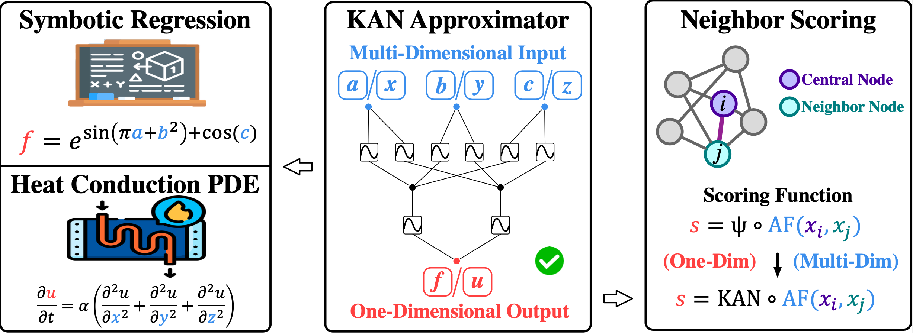

# KAA
This is a Pytorch code Implementation of the paper [*KAA: Kolmogorov-Arnold Attention for Enhancing Attentive Graph Neural Networks*](https://arxiv.org/abs/2501.13456), which is accepted by the ICLR 2025. Specifically, we apply KAN to the scoring functions of attentive GNNs and achieve better theoretical expressiveness and experimental results.



### Installation

We used the following packages under `Python 3.10`.

```
torch 2.4.0
torch_geometric 2.5.3
ogb 1.3.6
numpy 1.26.3
pandas 2.2.2
```

### Backbone Models

In our experiments, we introduced five backbone models: GAT, GLCN, CFGAT, GT, and SAN. Their original scoring functions and the KAA version of the scoring functions are shown in the table below.


### Usage

The training files for each dataset and task generally follow a unified format. Taking the node classification task on Cora as an example, locate the `train.py` for the corresponding model under the `node_classification/`. It has the following optional parameters:

```shell
usage: train.py [-h] [--model MODEL] [--hidden_dim HIDDEN_DIM] [--heads HEADS] [--device_num DEVICE_NUM] [--epoch_num EPOCH_NUM] [--lr LR] [--drop_rate DROP_RATE] [--kan_layers KAN_LAYERS] [--grid_size GRID_SIZE] [--spline_order SPLINE_ORDER] [--seed SEED] [--dataset DATASET] [--train_round TRAIN_ROUND] [--file_id FILE_ID]

PyTorch implementation of downstream adaptation.

options:
  -h, --help            show this help message and exit
  --model MODEL         the used model type
  --hidden_dim HIDDEN_DIM
                        the hidden dimension
  --heads HEADS         the head number
  --device_num DEVICE_NUM
                        the device number
  --epoch_num EPOCH_NUM
                        the epoch number
  --lr LR               the learning rate
  --drop_rate DROP_RATE
                        the dropping rate
  --kan_layers KAN_LAYERS
                        the kan layer number
  --grid_size GRID_SIZE
                        the grid size of kan
  --spline_order SPLINE_ORDER
                        the spline order of kan
  --seed SEED           the random seed
  --dataset DATASET     the test dataset
  --train_round TRAIN_ROUND
                        the train round number
  --file_id FILE_ID     the file id
```

You can conveniently use the methods described later under **Reproducibility** to obtain the results from the paper.

### Experimental Results

#### Node-Level Tasks

The performance of each model on node-level tasks is shown in the table below.


#### Graph-Level Tasks

The performance of each model on graph-level tasks is shown in the table below.


### Reproducibility

To obtain the results of the KAA version of each model in the experiment, you can run the corresponding commands in the `run.sh`.

```
bash run.sh
```

### Citation

You can cite our paper by following bibtex.

```
@inproceedings{Fang2025KAAKA,
  title={KAA: Kolmogorov-Arnold Attention for Enhancing Attentive Graph Neural Networks},
  author={Taoran Fang and Tianhong Gao and Chunping Wang and Yihao Shang and Wei Chow and Lei Chen and Yang Yang},
  booktitle={International Conference on Learning Representations},
  year={2025}
}
```

